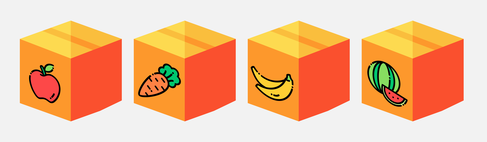

# Logic - Food Box
## Question Detail
มีกล่องบรรจุอาหารที่ต่างชนิดกันอยู่ 4 ใบ ดังรูป

ภายหลังพบว่า มีกล่องเพียง 1 ใบเท่านั้น ที่แสดงรูปอาหารได้อย่างถูกต้อง คุณจึงจะลองเปิดกล่องเพื่อตรวจสอบอาหารภายในกล่องดู

คำถามคือ จำนวนครั้งที่น้อยที่สุดในการเปิดกล่อง เพื่อที่จะทราบว่าอาหารแต่ละชนิดอยู่กล่องใดบ้าง เป็นกี่ครั้ง

## Answer
2 ครั้ง
