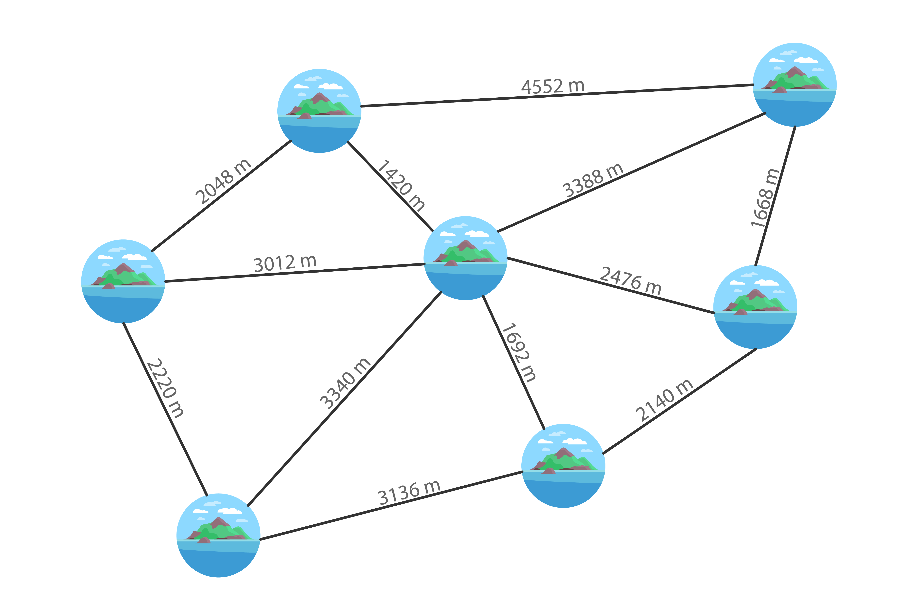
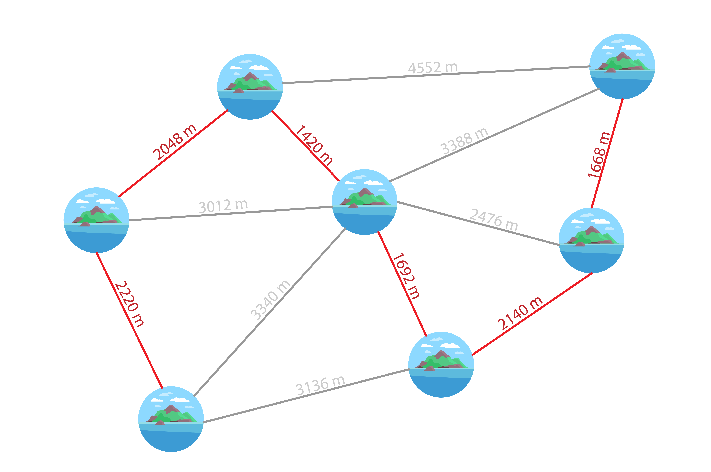

# 39 - Low Budget
## Question Detail
หมู่เกาะแห่งหนึ่ง ประกอบไปด้วยเกาะเล็ก ๆ จำนวน 7 เกาะ รัฐบาลเกิดความต้องการที่จะสร้างสะพานเชื่อมเกาะเหล่านี้ด้วยกัน เพื่อให้การเดินทางข้ามเกาะเป็นไปได้อย่างสะดวก แต่ว่าการสร้างสะพานนั้นต้องใช้งบประมาณสูง ซึ่งงบประมาณนั้นไม่ได้มีมาก รัฐบาลชุดนี้จึงเลือกที่จะสร้างสะพานให้น้อยที่สุด เพื่อจะได้เหลืองบประมาณไปบริหารประเทศในด้านอื่น ๆ

เงื่อนไขการสร้างสะพานมีดังนี้
- สร้างบนเส้นสีเทาที่ปรากฏในแผนผังเท่านั้น
- หากเริ่มเดินทางที่เกาะใด ๆ จะต้องสามารถเดินทางไปเกาะอื่น ๆ ทุกเกาะได้
- การสร้างสะพานทุก ๆ 50 เมตร ใช้งบประมาณเป็นจำนวน 1 ล้านบาท โดยเศษที่ไม่ครบ 50 เมตรให้คิดเต็มจำนวน 1 ล้านบาท
- จะคิดคำนวณงบประมาณสะพานแยกกันก่อน จึงค่อยนำค่าใช้จ่ายทั้งหมดมารวมกัน

โจทย์ข้อนี้อยากทราบว่า
- จะต้องสร้างสะพานอย่างไรเพื่อที่จะใช้งบน้อยที่สุด (วาดรูป)
- ใช้งบประมาณไปทั้งหมดกี่ล้านบาท

## Answer

ใช้งบประมาณทั้งหมด 226 ล้านบาท
